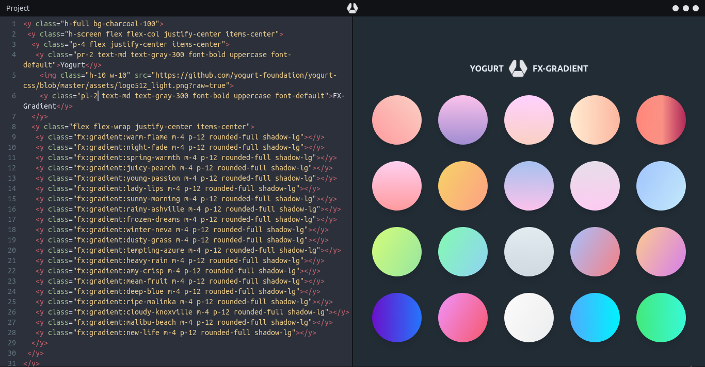
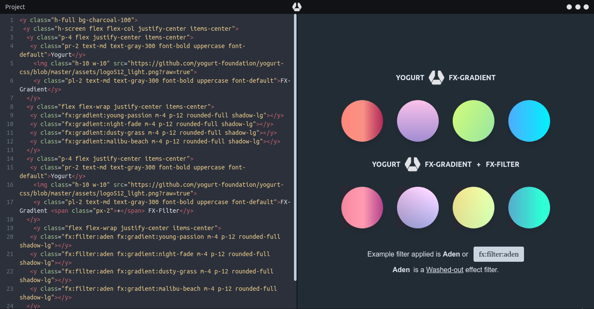

<p align="center">
  
</p>

<p align="left">
  
  
  
  
  
  
  
  
  
  
  
</p>

> A complete set of CSS gradient utility for web UI, (FX, aka `Special Effect`).

> Work in progress

Yogurt `{FX}.gradient` started out as a small side-project of mine. As I was increasingly using CSS animations and filters, I thought it would come in handy to have them organized in a meaningful and accessible way so that they can be easily reused on different projects.

I have been using `{FX}.gradient` for a while now and I hope some of you will find it useful as well. It is still very much a work in progress and hopefully it will evolve over the time.

Below are my special collection of css gradient over the years of making web design.

---

> Working on gradient previewer!

> **(!!)** this preset has completed

- warm-flame, night-fade, spring-warmth, juicy-pearch, young-passion, lady-lips, sunny-morning, rainy-ashville, frozen-dreams, winter-neva, dusty-grass, tempting-azure, heavy-rain, amy-crisp, mean-fruit, deep-blue, ripe-malinka, cloudy-knoxville, malibu-beach, new-life, true-sunset, morpheus-den, rare-wind, near-moon, wild-apple, saint-petersburg, plum-plate, everlasting-sky, happy-fisher, blessing, sharpeye-eagle, ladoga-bottom, lemon-gate, itmeo-branding, zeus-miracle, old-hat, star-wine, deep-blue, happy-acid, awesome-pine, new-york, shy-rainbow, mixed-hopes, fly-high, strong-bliss, fresh-milk, snow-again, february-ink, kind-steel, soft-grass, grown-early, sharp-blues, shady-water, dirty-beauty, great-whale, teen-notebook, polite-rumors, sweet-period, wide-matrix, soft-cherish, red-salvation, burning-spring, night-party, sky-glider, heaven-peach, purple-division, aqua-splash, spiky-naga, love-kiss, clean-mirror, premium-dark, cold-evening, cochiti-lake, summer-games, passionate-bed, mountain-rock, desert-hump, jungle-day, phoenix-start, october-silence, faraway-river, alchemist-lab, over-sun, premium-white, mars-party, eternal-constance, japan-blush, smiling-rain, cloudy-apple, big-mango, healthy-water, amour-amour, risky-concrete, strong-stick, vicious-stance, palo-alto, happy-memories, midnight-bloom, crystalline, party-bliss, confident-cloud, le-cocktail, river-city, frozen-berry, child-care, flying-lemon, new-retrowave, hidden-jaguar, above-the-sky, nega, dense-water, seashore, marble-wall, cheerful-caramel, night-sky, magic-lake, young-grass, colorful-peach, gentle-care, plum-bath, happy-unicorn, african-field, solid-stone, orange-juice, glass-water, north-miracle, fruit-blend, millennium-pine, high-flight, mole-hall, space-shift, forest-inei, royal-garden, rich-metal, juicy-cake, smart-indigo, sand-strike, norse-beauty, aqua-guidance, sun-veggie, sea-lord, black-sea, grass-shampoo, landing-aircraft, witch-dance, sleepless-night, angle-care, crystal-river, soft-lipstick, salt-mountain, perfect-white, fresh-oasis, strict-november, morning-salad, deep-relief, sea-strike, night-call, supreme-sky, light-blue, mind-crawl, lily, meadow, sugar-lollipop, sweet-dessert, magic-ray, teen-party, frozen-heat, gagarin-view, fabled-sunset, perfect-blue.

> (total) 169 effects

---

<p align="left">
  
  
</p>

## _introduction

> **(!!)** there are so much to do to make the class name easy to use.

the class name is always start with a prefix `fx:gradient:`, following with the effect name e.g. `warm-flame`.

## _usage

let's take an example of `Warm Flame` gradient, this add gradient to the element,

```html
<div class="fx:gradient:warm-flame">
  This is a background!
</div>
```
---

## _build

``` bash
# install dependencies
$ npm install

# build for production
$ npm run build
```

---

[MIT](https://github.com/yogurt-foundation/fx-gradient/blob/master/LICENSE)


